# Assembly
> **Estimated time:** 2 hours

*Exact component placements can be visualized in the [Fusion360 Online CAD](https://a360.co/44YAcMn)*

*We assume you already have a [Koch Arm](https://github.com/jess-moss/koch-v1-1) built WITH the modified base and modified static gripper*
### 1. Assemble Wheel Modules (3 per robot)

1. Attach the drive motor to the motor mount using 4 m2x5 tap screws.

    

2. Attach the wheel hub to the omniwheel using 2 m4x12 machine screws.

    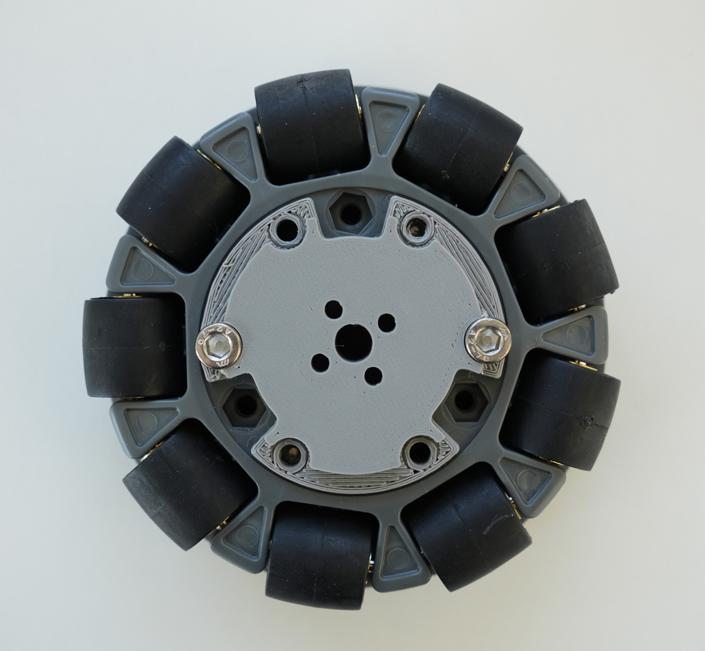

3. Attach the wheel hub to the servo horn using 4 m3x16 machine screws.

    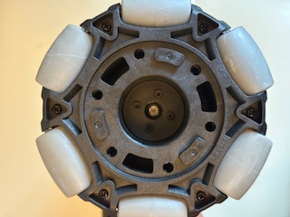

### 2. Bottom Plate Assembly
1. Assemble both plates by attaching the 3D-printed triangular insert to the TB3 plate. Align the outer holes and secure the insert using six M3x8 machine screws and matching nuts (the ones included with the TB3 plates).
    
    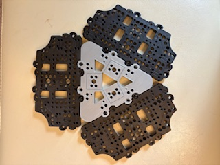

2. Screw each drive motor mount onto the bottom plate using 2 m3x12 machine screws in the front and 2 m2.5x12 machine screws in the back.
   
    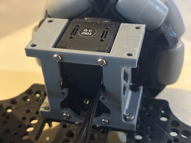

3. Connect the motor wires in series. Insert 2 m3 nuts into the slots on both the battery mount and the base camera mount. Then, attach the battery mount to the bottom plate using two m3x12mm machine screws. Secure the camera mount to the plate using two m3x16mm machine screws.
   
    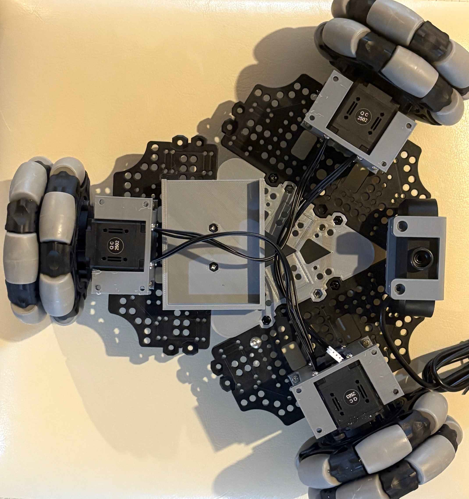

    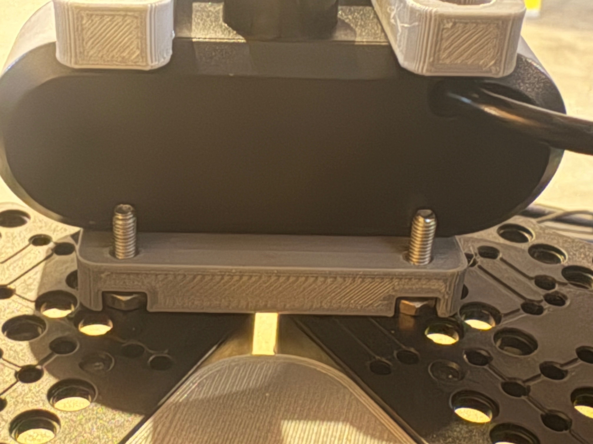

4. Wiring Electronics
   -    Use the wago lever connectors to connect the ground and power battery wire leads to the leads of the 12v->5v converter and the dc barrel plug adapter. 
   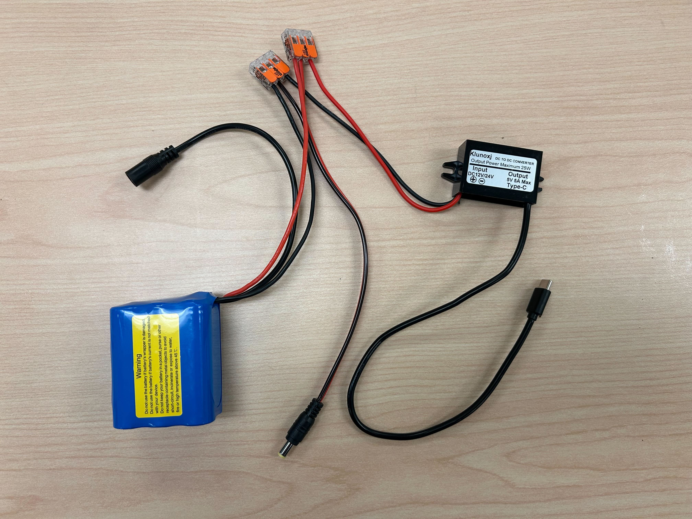

   -    Mount the 12V to 5V converter to the bottom plate using two m4x16mm machine screws and two m4 nuts. Then, connect the unconnected motor wire, the USB cable, and the power wires to the U2D2 power hub board. Attach standoffs to the U2D2 board, and secure it to the base plate using three m3x16mm machine screws.
   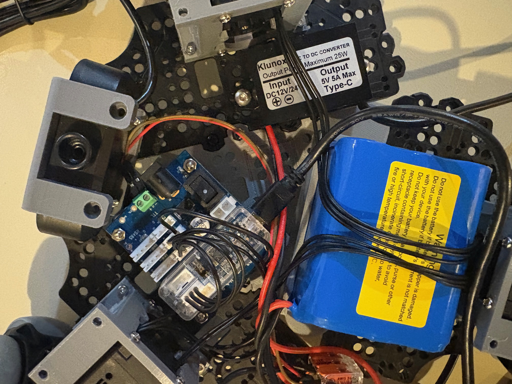 

### 3. Top plate Assembly
1. Place the Raspberry Pi 5 into the bottom half of the Pi case and snap on the top cover.

2. If you haven’t already, print the modified Koch arm base and the modified static gripper. Attach the webcam as shown.

    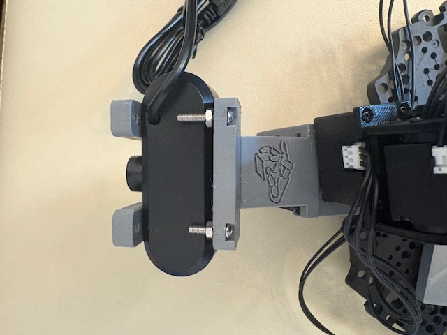
3. Mount the Raspberry Pi to the top plate using two M2x12 machine screws and nuts. Then, secure the Koch arm using four M3x12 machine screws and nuts.

    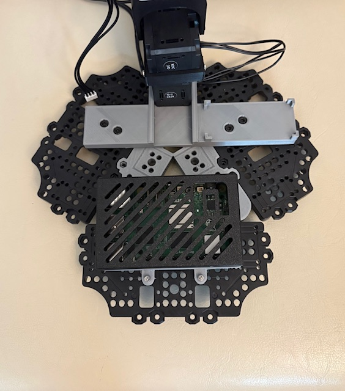

### 4. Final Assembly
1.  Connect the motor wire from the 5V motor to the U2D2 power hub board using jumper cables.  
    -    Route the power and ground wires through the voltage reducer, and then connect them to the appropriate 5V power and GND ports on the power hub board. 
    
    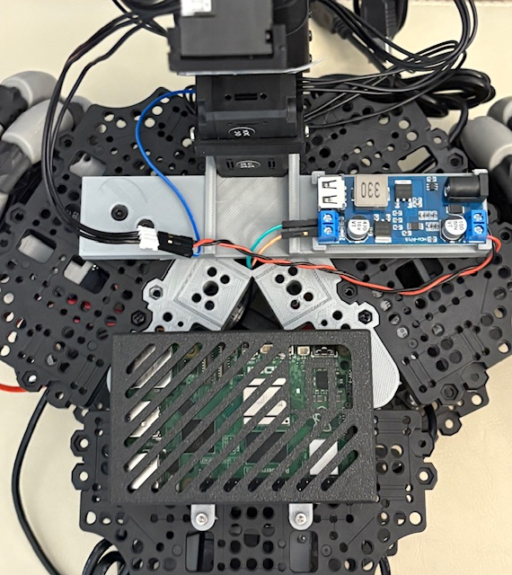
2. Route the data wire (blue wire in picture) directly to the data port on the power hub board. 
    -    Connect the remaining wire from the 12V motor at the base of the arm to the open port on one of the base drive motors.
    
    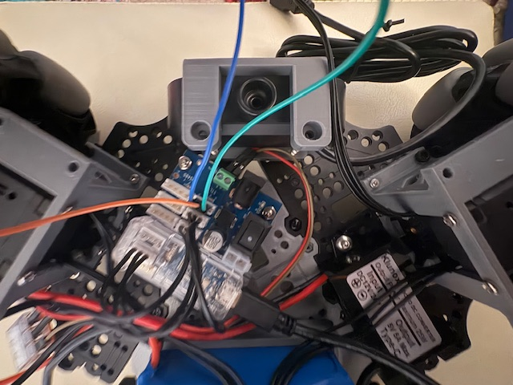

2. Feed the servo controller usb-c to usb-a, 5v usb-c power, and base webcam usb-a wires through the center hole in the top base plate. 

    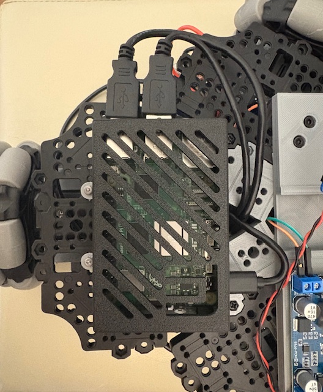

3. Mount the top  plate onto the motor mounts using 6 m3x12 machine screws.

    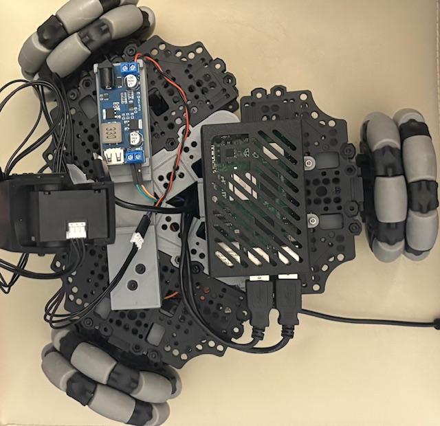

### Plug everything in and its ready!
Power the electronics by plugging in the DC barrel plug adapter to the servo motor controller and the 5v usb-c connector to the raspberry pi 5. The usb cables from the U2D2 power hub board and the cameras can directly be plugged in to the raspberry pi.

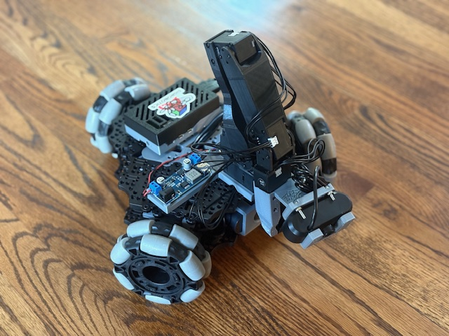 
