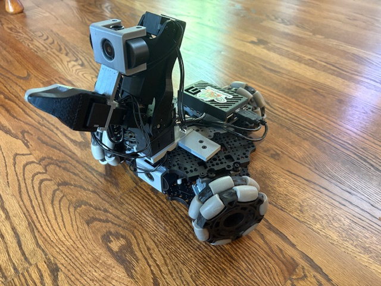

# Our Dynamixel Version!

  

1. Buy the parts following the [BOM](BOM.md)
2. Print all the parts listed in [3DPrinting](3DPrinting.md)
3. Follow our [Assembly](Assembly.md) to build the dynamixel LeKiwi

## Modified Lerobot Code For Teleoperation 

Here are the changes we made to the original LeKiwi code: [Dynamixel Teleop](https://github.com/SIGRobotics-UIUC/lerobot/commit/cc4adff50d33ef14ab579abfe554689732d0e5e5)

You can follow the original LeKiwi documentation with this modified code. Make sure to change ports, ips, etc. for your specific setup.
